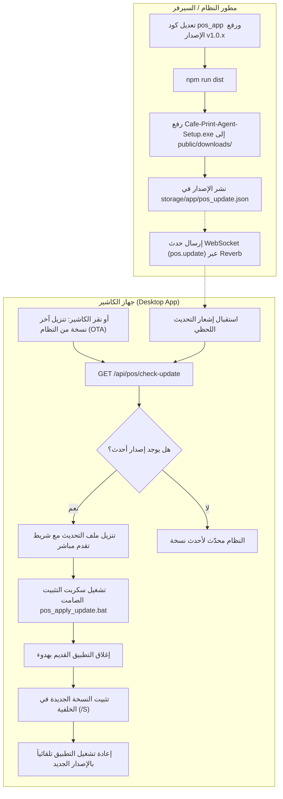

# دليل نظام التحديث الهوائي عن بُعد وطابعات الـ USB (OTA Remote Update System)

نظام التحديث عن بُعد (Over-The-Air Update) يتيح تحديث تطبيق كاشير سطح المكتب (`Cafe Print Agent` / Electron) على أجهزة الكاشير عن بُعد بنقرة زر واحدة أو تلقائياً بالكامل، دون الحاجة لنقل ملفات عبر فلاشات USB أو زيارة فرع الكاشير أو إعادة التثبيت اليدوي.

---

## 🏗️ 1. المخطط المعماري للنظام (Architecture & Flow)



---

## 🚀 2. كيفية نشر تحديث جديد مستقبلاً (Production Deployment Guide)

عندما ترغب في إجراء أي تعديل برمجي أو إضافة ميزة لتطبيق الكاشير ونشرها للعملاء:

### الخطوة 1: تعديل الكود ورفع رقم الإصدار
افتح ملف `pos_app/package.json` وارفع الإصدار، مثلاً من `1.0.1` إلى `1.0.2`:
```json
{
  "name": "pos-print-agent",
  "version": "1.0.2"
}
```
وكذلك في `pos_app/config.json`:
```json
{
  "version": "1.0.2"
}
```

### الخطوة 2: تجميع نسخة التثبيت الجديدة
في موجه الأوامر داخل مجلد `pos_app`:
```bash
cd pos_app
npm run dist
```
سيتم توليد ملف التثبيت المحدث:
`pos_app/dist/Cafe-Print-Agent-Setup-1.0.2.exe`

### الخطوة 3: وضع الملف في مجلد التنزيل بالسيرفر
انسخ الملف الناتج إلى مسار التنزيل بالسيرفر:
```powershell
Copy-Item "pos_app\dist\Cafe-Print-Agent-Setup-1.0.2.exe" "public\downloads\Cafe-Print-Agent-Setup.exe" -Force
```

### الخطوة 4: الإعلان عن الإصدار الجديد
قم بتعديل ملف `storage/app/pos_update.json` على السيرفر:
```json
{
  "version": "1.0.2",
  "download_url": "/downloads/Cafe-Print-Agent-Setup.exe",
  "release_notes": "وصف التعديلات والتحسينات الجديدة التي تمت إضافتها",
  "mandatory": false
}
```
*(أو إرسال طلب `POST` إلى `/api/pos/publish-update` ببيانات الإصدار)*.

**النتيجة:**
في غضون دقائق (أو فور نقر الكاشير على زر التحديث الهوائي)، سيقوم تطبيق الكاشير بتحميل التحديث وتثبيته وإعادة التشغيل ذاتياً بالإصدار الجديد.

---

## 🖨️ 3. طابعات الـ USB ونظام الويندوز (USB Printers Direct Spooler)

### المشكلة السابقة:
كانت الطابعات الموصولة عبر USB تطالب الكاشير بإدخال عنوان IP ومنفذ Port، وتفشل بطباعة خطأ `ECONNREFUSED 127.0.0.1:9100` وحالة `Offline`.

### الحل المطبق:
1. **واجهة مخصصة لطابعات USB:**
   - تم إضافة خيار **طابعة USB / نظام (Windows)** في شاشة إضافة وتعديل الطابعات.
   - عند اختياره، تختفي حقول IP والمنفذ تلقائياً.
   - يتعرف التطبيق تلقائياً على جميع الطابعات المثبتة في نظام التشغيل (مثل `XP-80C` و `XP-80C copy 1`).
2. **الطباعة المباشرة عبر Windows Spooler RAW:**
   - استخدام استدعاءات `winspool.drv` المباشرة (`OpenPrinterW`, `StartDocPrinterW`, `WritePrinter`).
   - إلغاء الحاجة لفتح TCP Socket 9100 لطابعات الـ USB.
   - التخزين المؤقت الذكي (Caching) لقائمة الطابعات لمنع بطء استجابة واجهة المستخدم.

---

## 🔌 4. مسارات الـ API الخاصة بنظام التحديث (Endpoints)

### 1. فحص التحديثات
* **المسار:** `GET /api/pos/check-update`
* **المعاملات (Query Params):**
  * `current_version`: رقم إصدار التطبيق الحالي المثبت (مثال: `1.0.0`).
* **الاستجابة:**
  ```json
  {
    "latest_version": "1.0.1",
    "update_available": true,
    "download_url": "https://your-domain.com/downloads/Cafe-Print-Agent-Setup.exe",
    "release_notes": "إصلاح طابعات الـ USB والتحديث التلقائي عن بُعد",
    "mandatory": false
  }
  ```

### 2. نشر تحديث جديد (Admin API)
* **المسار:** `POST /api/pos/publish-update`
* **البيانات (JSON Payload):**
  ```json
  {
    "version": "1.0.2",
    "download_url": "/downloads/Cafe-Print-Agent-Setup.exe",
    "release_notes": "تحديث مميزات الفواتير والطباعة",
    "mandatory": false
  }
  ```

---

## 🛡️ 5. تثبيت الإصدار الأولي على جهاز الكاشير

1. يتم نسخ ملف التثبيت الأولي التالي وتثبيته على جهاز الكاشير (لمرة واحدة فقط):
   `pos_app/dist/Cafe Print Agent Setup.exe` (الإصدار `1.0.1`).
2. بعد اكتمال التثبيت، افتح التطبيق واذهب إلى **الطابعات** -> **إضافة طابعة** -> اختر **طابعة USB / نظام** -> اختر اسم الطابعة من القائمة -> **حفظ واختبار**.
3. من هذه اللحظة، يصبح الجهاز جاهزاً لاستقبال جميع التحديثات المستقبلية عبر الإنترنت بنقرة واحدة.
